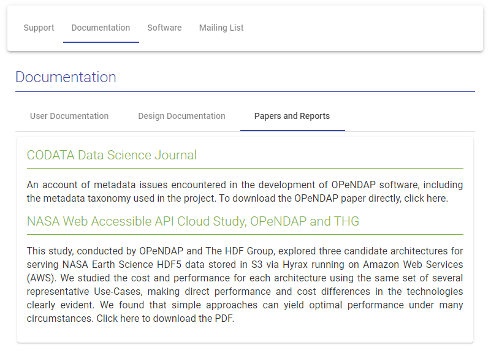

# OPeNDAP.org Site Readme

## 1.Installing OPeNDAP.org Node.js Server

The new OPeNDAP.org site has been developed using Angular CLI for the front-end
and Node.js for the back-end. The site is template-driven, meaning that most
content editing is done outside of HTML. This requires a server to serve
data to the front-end, which is where Node.js enters the picture.

This tutorial will guide your installation of the OPeNDAP.org Node.js server
on an linux machine running Ubuntu 18+.

NOTE: Please note that the following tutorial
should work on other flavors of linux, with minor adjustments for package
management. (For example, CentOS uses `yum` instead of `apt`).

### 1.1. Install and Configure Apache

You have to configure Apache to allow secure external access to the front-end interface.
Note that much of this section was taken from [digitalocean.com](https://www.digitalocean.com/community/tutorials/how-to-install-the-apache-web-server-on-ubuntu-18-04-quickstart).

#### 1.1.1. Install Apache

Update your local package index:

````bash
sudo apt update
````

Install the `apache2` package:

````bash
sudo apt install apache2
````

You can confirm that the Apache2 installation succeeded by entering your server's IP
into a web browser. If you see the default Apache page, you have suceeded.

#### 1.1.2 Configure UFW (Uncomplicated Firewall)

````bash
sudo ufw app list
````

Response:

````bash
Available applications:
  Apache
  Apache Full
  Apache Secure
  OpenSSH
````

This is the most restrictive profile that will let in traffic on port 80:

````bash
sudo ufw allow 'Apache'
````

### 1.1.3 Configure Apache Proxy

You now need to configure Apache to proxy all requests incoming on port 80
to the node.js server's port. Start by enabling Apache's proxy modules:

````bash
a2enmod proxy
a2enmod proxy_http
````

Next, you need to createa a VirtualHost that will forward port 80 requests
to the node.js server's port, in this case, 3001. Navigate to
Apache's `sites-available` directory, which is usually the following on Ubuntu:

````bash
/etc/apache2/sites-available/
````

Create the VirtualHost file in `sites-available` and make sure that Apache has
read/write access:

````bash
touch opendap.conf
chmod 755 opendap.conf
````

Using your editor of choice, insert the following XML into `opendap.conf`:

````XML
<VirtualHost *:80>
        ServerAdmin webmaster@localhost
        ServerName opendap.org
        DocumentRoot /var/www/html/opendap.org-server/dist/website
        <Directory />
                AllowOverride All
        </Directory>
        ProxyRequests Off
        ProxyPreserveHost On
        ProxyVia Full
        <Proxy *>
                Require all granted
        </Proxy>
        <Location "/">
                ProxyPass http://127.0.0.1:3001/
                ProxyPassReverse http://127.0.0.1:3001/
        </Location>
        ErrorLog ${APACHE_LOG_DIR}/error.log
        LogLevel warn
        CustomLog ${APACHE_LOG_DIR}/access.log combined
</VirtualHost>
````

After you have edited the file, execute the following:

````BASH
sudo a2dissite 000-default.conf
sudo a2ensite opendap.conf
````

Restart Apache:

````BASH
sudo systemctl reload apache2
````

### 1.2. Clone Server Repo

After configuring Apache, clone the [server repository](https://github.com/alexporrello/opendap.org-server)
into `/var/www/html`:

````bash
ubuntu@ip-172-31-52-254:/var/www/html$ sudo git clone https://github.com/OPENDAP/opendap.org-server
Cloning into 'opendap.org-server'...
Username for 'https://github.com': jgallagher59701
Password for 'https://jgallagher59701@github.com': 
remote: Enumerating objects: 271, done.
remote: Counting objects: 100% (271/271), done.
remote: Compressing objects: 100% (236/236), done.
remote: Total 271 (delta 109), reused 187 (delta 28), pack-reused 0
Receiving objects: 100% (271/271), 2.71 MiB | 17.56 MiB/s, done.
Resolving deltas: 100% (109/109), done.
ubuntu@ip-172-31-52-254:/var/www/html$ 
````

### 1.3. Install and Configure Node

#### 1.3.1. Install Node.js

Install Node.js:

````bash
sudo apt install nodejs
````

You can confirm your node installation with the command `nodejs -v`. 
If your node installation has succeeded, the output will be node's version
number, such as `v8.10.0`.

Node.js relies on Node Package Manager (NPM). Install NPM:

````bash
sudo apt install npm
````

#### 1.3.2. Install the Server

In the server directory (`/var/www/html/opendap.org-server`), run:

````bash
sudo npm install
````

#### 1.3.3 Install PM2

PM2 is the process manager we're going to be using to manage our node.js
instance. To install PM2, run:

````BASH
sudo npm install -g pm2
````

#### 1.3.4 Start the Server

If you're not already there, navigate to the `opendap.org-server` directory,
and run:

````BASH
pm2 start server.js --name opendap.org
````

This will launch the server, whose code is contained with the `server.js` file,
in the background. After you've run the pm2 start command, you should receive
output like the following:

````BASTH
[PM2] Starting /var/www/html/opendap.org-server/server.js in fork_mode (1 instance)
[PM2] Done.
┌────┬────────────────────┬──────────┬──────┬───────────┬──────────┬──────────┐
│ id │ name               │ mode     │ ↺    │ status    │ cpu      │ memory   │
├────┼────────────────────┼──────────┼──────┼───────────┼──────────┼──────────┤
│ 0  │ opendap.org        │ fork     │ 0    │ online    │ 0%       │ 16.5mb   │
└────┴────────────────────┴──────────┴──────┴───────────┴──────────┴──────────┘
````

## 2. Contributing and Editing Content

The new site design for OPeNDAP.org is intended to be dynamic. Most of the site's content
is contained within AsciiDoc markdown files that are housed within the server's `public`
folder.

### 2.1 Editing Content

Examples of dynamic content stored within AsciiDoc files are...

* About OPeNDAP
* Software Homepage
* Support Homepage
* All FAQ content
* Release notes for Hyrax versions

In most cases, updating the website's content is as simple as...

1. Enter `./public` and locate the file that is associated with the page you'd like to edit. For example, the content for
the About OPeNDAP page is housed within `./public/adoc/about-us.adoc`.
1. Update the content within the file.
1. Commit the changes to the `opendap.org-server` Git repository.
1. On the OPeNDAP.org host server, pull down the changes.

For more structurally complicated pages, such as the support pages,
the situation is slightly more complex.

### 2.2 Editing `.conf`-driven Content

What I call `.conf`-driven content is web content that is loaded to the
website via a configuration file. This is especially useful in instances
where content needs to be catagorized by more than just headings. For example,
the About OPeNDAP page contains not only a simple page navigation bar at the
top of the page, but also by tabbed content, such as the `Documentation` section:



Notice how the `Documentation` section of the Support page has three tabs:

* User Documentation
* Design Documentation
* Papers and Reports

The tabs are achieved by the `support.conf.json` file.

#### 2.2.1 `.conf` Files

A `.conf` file is a json file with the following structure:

````JSON
{
        "sections": [
                {
                        // Section A
                },
                {
                        // Section B
                }
                ...
        ]
}
````

There are a few types of sections:

* Standard
* Tabbed

A standard section has the following structure:

````JSON
{
        "sectionType": "standard",
        "title": "Title",
        "id": "page_id", // Good convention is lowercase title.
        "filename": "document_name.adoc",
        "parsedFile": ""
},
````

A tabbed section has the following structure:

````JSON
{
        "sectionType": "tabbed",
        "title": "title",
        "id": "page_id",
        "tabs": [
                {
                        // Tab A
                },
                {
                        // Tab B
                }
        ]
}
````

